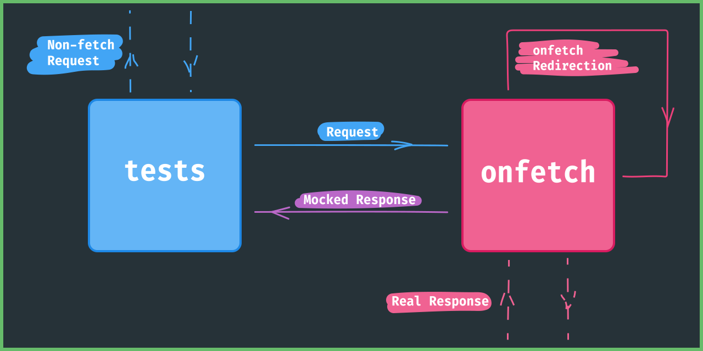

<div align="end"><sub>
  ENGLISH,
  <a title="Simplified Chinese" href="README.zh-Hans.md">简体中文</a>
</sub></div>

# onfetch
[q-a]: https://github.com/PaperStrike/onfetch/discussions/categories/q-a
[contributing]: https://github.com/PaperStrike/onfetch/blob/main/.github/CONTRIBUTING.md

[mdn-fetch-func]: https://developer.mozilla.org/en-US/docs/Web/API/fetch
[mdn-request-api]: https://developer.mozilla.org/en-US/docs/Web/API/Request
[mdn-response-api]: https://developer.mozilla.org/en-US/docs/Web/API/Response

[](https://github.com/PaperStrike/onfetch/actions/workflows/test.yml)
[](https://www.npmjs.com/package/onfetch)

Mock `fetch()` with native [`Request`][mdn-request-api] / [`Response`][mdn-response-api] API. Works with [`globalThis`](#default), [service worker](#service-worker), [`@mswjs/interceptors`](#msw-interceptors), and [custom contexts](#custom-context).

---

🐿️ Jump to
[Callback](#callback),
[Delay](#delay),
[Redirect](#redirect),
[Times](#times),
[Restore](#restore),
[Context](#context),
[Options](#options),
[Q&A][q-a],
or
[Contributing Guide][contributing].

## Basic
[mdn-headers-api]: https://developer.mozilla.org/en-US/docs/Web/API/Headers

Start with `onfetch`, pass the same params as constructing a [`Request`][mdn-request-api] object. Then `reply` as constructing a [`Response`][mdn-response-api] object.

```js
import onfetch from 'onfetch';

onfetch('/simple').reply('path');

// Or
onfetch('/post', { method: 'POST' })
  .reply('received');

// Or
onfetch('/down')
  .reply(null, { status: 500 });
```

Works with [`node-fetch`](https://github.com/node-fetch/node-fetch), [`whatwg-fetch`](https://github.com/github/fetch), [`cross-fetch`](https://github.com/lquixada/cross-fetch), whatever, and mainly, modern browsers.

In Node, in addition to setting up global [`fetch`][mdn-fetch-func], you also need to set up global [`Headers`][mdn-headers-api], [`Request`][mdn-request-api], and [`Response`][mdn-response-api].

### Matching
[mdn-request-body]: https://developer.mozilla.org/en-US/docs/Web/API/Request/body

How `onfetch` uses your params to match a [`Request`][mdn-request-api].

To keep this simple and efficient, we don't and won't support [`body`][mdn-request-body] matching. You will have to put your own processing code into a [reply callback](#callback) when needed.

Rules without a positive [`times`](#times) match no request.

#### String
[mdn-url-api]: https://developer.mozilla.org/en-US/docs/Web/API/URL

A string matches the request's URL if all the following checks pass:

1. Split into three parts. Path, query string and hash.
2. Check if the path matches the request's path.
3. For the query string and hash, if not empty, check if it matches the request's one.

```js
onfetch('/string').persist();

fetch('/string'); // match
fetch('/string?query'); // match
fetch('/string#hash'); // match
```

```js
onfetch('/string?specify-query').persist();

fetch('/string'); // not match
fetch('/string?other-query'); // not match
fetch('/string?specify-query'); // match
fetch('/string?specify-query#hash'); // match
```

The use of [`persist()`](#persist) allows the above `onfetch` rules to match an unlimited number of times.

#### RequestInit
[idl-request-init]: https://fetch.spec.whatwg.org/#requestinit

The second param, a [`RequestInit`][idl-request-init] object, matches the [`Request`][mdn-request-api], when all the checks in the following steps pass:

1. Deconstruct `headers`, `body`, `window` and the _rest parts_ from the [`RequestInit`][idl-request-init] object.
2. Check if each header in `headers` has a match in the request's headers.
3. Check if each part in the _rest parts_ has a match in the [`Request`][mdn-request-api].

```js
onfetch('', {
  method: 'GET',
  headers: {
    'Content-Type': 'text/plain',
  },
}).persist();

// not match
fetch('', { method: 'GET' });

// not match
fetch('', {
  method: 'POST',
  headers: {
    'Content-Type': 'text/plain',
  },
});

// match
fetch('', {
  cache: 'no-cache',
  method: 'GET',
  headers: {
    'Accept': 'text/html',
    'Content-Type': 'text/plain',
  },
});
```

#### RegExp
[mdn-regexp-api]: https://developer.mozilla.org/en-US/docs/Web/JavaScript/Reference/Global_Objects/RegExp

Other than using strings, you can also pass a [`RegExp`][mdn-regexp-api] as the first arg to test the request's URL.

```js
// Match URLs that ends with '.foo'.
onfetch(/\.foo$/).reply('bar');
```

Put it in consideration that [`RegExp`][mdn-regexp-api] here test against the _entire URL string_, which means, if this `onfetch` rule needn't care about the query string nor the hash, write it like:

```js
// Use regexp that
// allows any trailing query string and hash.
onfetch(/^[^?#]*\.foo([?#]|$)/).reply('bar');
```

#### URLPattern
[mdn-url-pattern-api]: https://developer.mozilla.org/en-US/docs/Web/API/URLPattern

You can also use the brand new [`URLPattern`][mdn-url-pattern-api] in the first arg.

```js
const pattern = new URLPattern('http{s}?://*.example.com/books/:id');
onfetch(pattern);
```

In fact, the first arg accepts any object that has a `test` method that takes the URL string and returns a boolean value indicating the match result.

#### Request

You can also pass a [`Request`][mdn-request-api] object as the first arg, to match the request in a manner similar with the [`RequestInit` matcher](#requestinit).

## Callback
[idl-body-init]: https://fetch.spec.whatwg.org/#bodyinit
[mdn-promise-api]: https://developer.mozilla.org/en-US/docs/Web/JavaScript/Reference/Global_Objects/Promise

Other than `reply` as constructing a [`Response`][mdn-response-api], you can also pass a callback function to form the response.

Your callback will receive two params, the first one points to the [`Request`][mdn-request-api] object, the second one gives you both the original and the mocked `fetch`.

Remember to return a [`Response`][mdn-response-api], [`BodyInit`][idl-body-init], `null`, or a [`Promise`][mdn-promise-api] that resolves to one of them.

```js
onfetch('').reply((request, fetchers) => {
  const example = request.headers.get('One');
  if (example === 'original') {
    return fetchers.original(request);
  }
  if (example === 'mocked') {
    return fetchers.mocked('/mocked');
  }
  return 'default-response';
});
```

### passThough

A syntactic sugar for sending requests via the original `fetch`.

```js
import onfetch, { passThrough } from 'onfetch';
onfetch('/use-original').reply(passThrough);
```

## Delay

```js
// Delay 200ms before reply.
onfetch('').delay(200).reply('');
```

The order of `delay` and `reply` does not affect the result.

```js
// Same effect.
onfetch('').reply('').delay(200);
```

The delay duration accumulates.

```js
// Delay 400ms before reply.
onfetch('').delay(200).delay(300).delay(-100).reply('');
```

## Redirect
[redirect-status]: https://fetch.spec.whatwg.org/#redirect-status
[mdn-response-redirect]: https://developer.mozilla.org/en-US/docs/Web/API/Response/redirect
[mdn-request-redirect]: https://developer.mozilla.org/en-US/docs/Web/API/Request/redirect
[mdn-response-redirected]: https://developer.mozilla.org/en-US/docs/Web/API/Response/redirected
[mdn-response-url]: https://developer.mozilla.org/en-US/docs/Web/API/Response/url

Use a [`Response`][mdn-response-api] object that has [a redirect status][redirect-status] to redirect requests. You can use [`Response.redirect`][mdn-response-redirect] to construct a such object.

```js
// Redirect to '/bar'.
onfetch('/foo').reply(Response.redirect('/bar'));

// `/bar` respond with `redirected`.
onfetch('/bar').reply('redirected');

// Logs 'redirected'
fetch('/foo').then((res) => res.text()).then(console.log);
```

### Limitations

- In [default mode](#default), redirecting a [`Request`][mdn-request-api] with [`redirect`][mdn-request-redirect] set to a value other than `follow` will fail the fetch with a `TypeError`.
- In [default mode](#default), a redirected [`Response`][mdn-response-api] only has the correct [`redirected`][mdn-response-redirected] and [`url`][mdn-response-url] properties defined on the response object itself. Reading them via the prototype will give you incorrect values.

## Times

You can specify the number of times to apply the `onfetch` rule via the `times` function. It accepts an integer as the number of applications of the rule.

```js
// Apply this rule 5 times.
onfetch('/foo').times(5).reply('bar');
```

You may have multiple rules matching a request at the same time, but only the first rule will apply.

By default, an `onfetch` rule only applies _once_. When the times ran out, it bypasses the match.

```js
onfetch('/foo').reply('alpha');
onfetch('/foo').reply('beta');

// Logs 'alpha'
fetch('/foo').then((res) => res.text()).then(console.log);

// Logs 'beta'
fetch('/foo').then((res) => res.text()).then(console.log);
```

You can specify the times at any time as long as you store the reference of the `onfetch` rule somewhere.

```js
const onFoo = onfetch('/foo').reply('bar');

fetch('/foo'); // match

// Once again.
onFoo.once();

fetch('/foo'); // match
```

Note that when all the `onfetch` rules do not match a request, that request goes to [`options.defaultRule`](#default-rule).

The `times(n)` doesn't accumulate. It overrides.

```js
const onFoo = onfetch('/foo').twice().once().reply('bar');

fetch('/foo'); // match
fetch('/foo'); // fallback to `defaultRule`
```

### `once()`

A syntactic sugar for `rule.times(1)`.

### `twice()`

Syntactic sugar for `rule.times(2)`.

### `thrice()`

Sugar for `rule.times(3)`.

### `persist()`

For `rule.times(Infinity)`.

## Restoration

### Restore

`restore` deactivates `onfetch` to stop intercepting HTTP calls. Note that it does not clear any intercept rules.

```js
onfetch.restore();
```

### Remove a single rule

```js
const first = onfetch('/same').reply('first');
onfetch('/same').reply('second');

onfetch.remove(first);

// Logs 'second'
fetch('/foo').then((res) => res.text()).then(console.log);
```

### Remove all intercept rules

```js
onfetch.cleanAll();
```

### Activate

To (re-)activate `onfetch` to start intercepting HTTP calls, you can use `activate()`.

`onfetch` activates itself when you first import it.

```js
onfetch.restore();

// After some code.

onfetch.activate();
```

## Context

### Default
[mdn-global-this-global]: https://developer.mozilla.org/en-US/docs/Web/JavaScript/Reference/Global_Objects/globalThis

In the default mode, `onfetch` intercepts calls to the `fetch()` method on [`globalThis`][mdn-global-this-global].

To switch back from another mode to this, run:

```js
await onfetch.useDefault();
```

### Service Worker
[mdn-service-worker-api]: https://developer.mozilla.org/en-US/docs/Web/API/Service_Worker_API
[mdn-xml-http-request-api]: https://developer.mozilla.org/en-US/docs/Web/API/XMLHttpRequest

[Service Worker API][mdn-service-worker-api] only works in browsers.

With the help of [Service Worker API][mdn-service-worker-api], you can now mock **all** the resources your page requires, including those don't go with [XMLHttpRequest][mdn-xml-http-request-api] nor [`fetch`][mdn-fetch-func] (e.g., CSS files).

```js
// In the main browsing context.
import onfetch from 'onfetch';

await onfetch.useServiceWorker();

onfetch('/script.js').reply('console.log(\'mocked!\')');
const script = document.createElement('script');
script.src = '/script.js';

// Logs 'mocked!'
document.head.append(script);
```

To enable this feature, import `onfetch/sw` in your service worker.

```js
// In the service worker.
import 'onfetch/sw';
```

To switch back to the standard mode in the client side, call `onfetch.useDefault()`.

To disable `onfetch/sw` in the worker side, store its default import value beforehand, and call its `restore` method.

```js
// In the service worker.
import onfetchWorker from 'onfetch/sw';

self.addEventListener('message', async ({ data }) => {
  // To re-activate, call `.activate()`.
  if (data?.example) await onfetchWorker.restore();

  // ...
});
```

### MSW Interceptors
[msw-interceptors]: https://github.com/mswjs/interceptors

[`@mswjs/interceptors`][msw-interceptors] is a HTTP/HTTPS/XHR/fetch request interception library that can intercept most of the requests in Node.js.

With the help of [`@mswjs/interceptors`][msw-interceptors], we can mock almost all the resources our Node tests requires. To install, run:

```shell
npm i @mswjs/interceptors --save-dev
```

Then somewhere in your test cases, call `useMSWInterceptors`.

```js
// Switch to @mswjs/interceptors mode.
await onfetch.useMSWInterceptors();
```

### Auto Advanced

Auto Advanced mode uses either [service worker mode](#service-worker) or [msw interceptors mode](#msw-interceptors) depending on whether the env supports the [Service Worker API][mdn-service-worker-api].

```js
// Switch to service worker mode, if the env supports it.
// Otherwise, switch to @mswjs/interceptors mode.
await onfetch.useAutoAdvanced();
```

### Custom Context

`onfetch` works by replacing the `fetch` property of a given "context" with a mocked one. By default, this context refers to [`globalThis`][mdn-global-this-global]. The [service worker mode](#service-worker) and [msw interceptors mode](#msw-interceptors) integrates with `onfetch` by transmitting requests to the `fetch()` method of an object and passing this object to `onfetch` as the "context". By doing so `onfetch` can intercept the requests.

You can write a custom context like:

```js
class SimpleContext {
  fetch = async () => new Response('original');
}

const context = new SimpleContext();
```

Then use `onfetch.adopt()` to let `onfetch` use this `context`.

```js
await onfetch.adopt(context);
```

Now, all the accesses to the `context`'s `fetch()` method get intercepted.

```js
onfetch('/basic').reply('mocked');
onfetch('/bypass').reply(passThrough);

// Logs 'mocked'
context.fetch('/basic')
  .then((res) => res.text())
  .then(console.log);

// Logs 'original'
context.fetch('/bypass')
  .then((res) => res.text())
  .then(console.log);
```

## Request Flow

In default mode:



In [service worker mode](#service-worker):


## Options

Configurable via `onfetch.config`.

### Default Rule

The rule used when all `onfetch` rules failed to match a request. You can form a rule by constructing a `InterceptRule` object, which accepts the same params as `onfetch`.

```js
import onfetch, { InterceptRule } from 'onfetch';
onfetch.config({
  defaultRule: new InterceptRule('').reply('default'),
});
```

Defaults to:

```js
new InterceptRule('').reply((request) => {
  throw new Error('No onfetch rule matches this fetch request');
})
```

### Abort Error

Constructor for abort errors. It should extend from `Error` and its instance should have the `name` property set to `AbortError`.

```js
import onfetch from 'onfetch';
onfetch.config({
  AbortError: PutItHere,
});
```

In Browsers, defaults to:

```js
DOMException.bind(null, 'The user aborted a request.', 'AbortError');
```

In Node, defaults to:

```js
class AbortError extends Error {
  name = 'AbortError';

  constructor() {
    super('The user aborted a request.');
  }
}
```

### Bypass Redirect

Set this to `true` to bypass `onfetch` [redirection](#redirect).

```js
import onfetch from 'onfetch';
onfetch.config({
  bypassRedirect: true, // or false
});
```

In [advanced modes](#auto-advanced), this defaults to `true`, as the browser / downstream package will handle the redirections on its own (see [request flow](#request-flow)). So we can overcome some [redirect limitations](#limitations).

## Q&A

Checkout our [Q&A Discussions][q-a] for your answers. 👍

## Contributing

Checkout our [Contributing Guide][contributing] please. 👍

## License
[license]: https://github.com/PaperStrike/onfetch/blob/main/LICENSE

[ISC][license]
